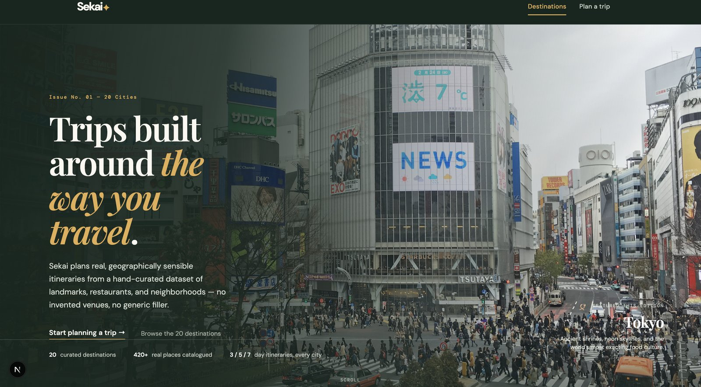
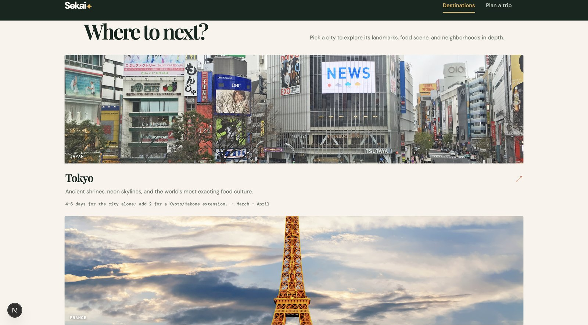
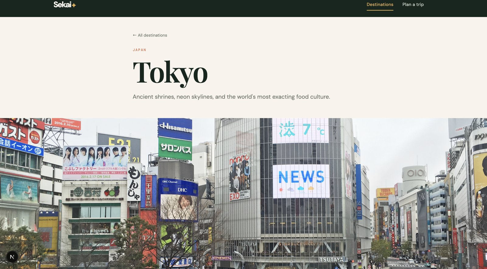
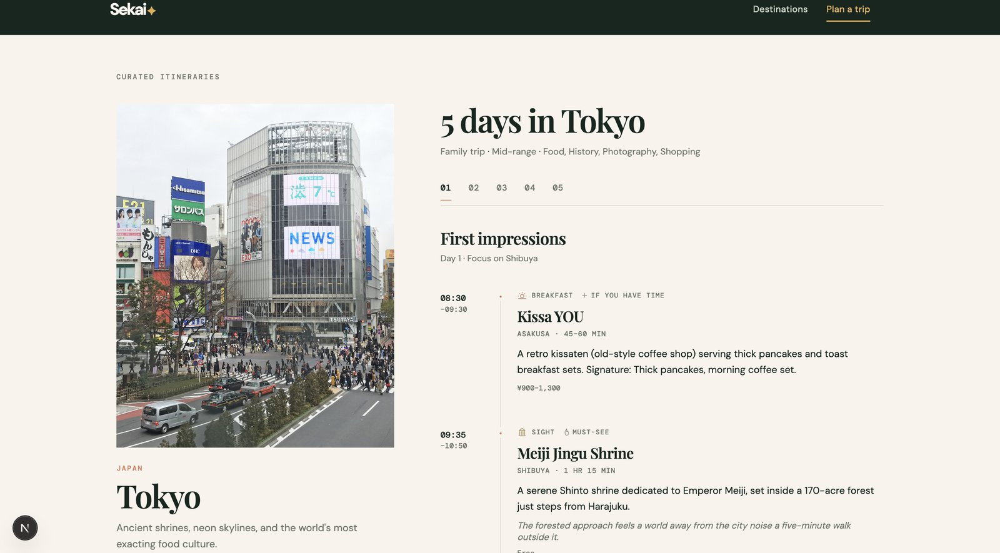

# Sekai — real itineraries for 20 cities

**A travel-planning app that builds day-by-day itineraries from a hand-curated dataset
of real, named, verifiable places — no invented venues, no AI-hallucinated
restaurants, no generic filler.**

[](https://nextjs.org)
[](https://www.typescriptlang.org)
[](LICENSE)

## Screenshots

| Homepage | Destination hub |
|---|---|
|  |  |

| Destination detail | Generated itinerary |
|---|---|
|  |  |

## What it does

- **20 fully documented destinations** (Tokyo, Paris, London, Dubai, Singapore, Bangkok,
  Rome, Barcelona, New York City, Istanbul, Seoul, Amsterdam, Copenhagen, Hong Kong,
  Sydney, Zurich, Los Angeles, Kuala Lumpur, Vienna, Lisbon), each with landmarks,
  restaurants, cafés, neighborhoods, shopping, nightlife, experiences, day trips,
  transportation, and practical travel info — hundreds of real, individually
  researched places in total.
- **A deterministic itinerary engine** (`lib/itinerary-engine.ts`) that clusters stops
  geographically by neighborhood, paces meals and breaks realistically, avoids
  overpacking a day, and adapts the plan to trip length (3/5/7 days), budget, travel
  style, and interests — no LLM call, no external API, same input always produces
  the same well-formed output.
- **Real, licensed destination photography**, sourced from Wikimedia Commons and
  individually verified (see `/credits` once running, or `CREDITS.md`).
- **No external APIs required to run it.** Everything runs from the static dataset in
  `lib/data/`, so there's nothing to configure and nothing that can invent a place
  that doesn't exist.

## Why this exists

Most "AI travel planner" demos wire an LLM to a prompt and call it done — which means
the itinerary is only as good as whatever the model happened to hallucinate that day,
with no guarantee a restaurant exists, a museum is still open, or two "must-see" stops
aren't a 90-minute walk apart. Sekai takes the opposite approach: **the data is real
and hand-verified, and the planning logic is a deterministic algorithm, not a model.**

The itinerary engine specifically handles:
- **Geographic clustering** — ranks each city's neighborhoods against the traveler's
  interests and travel style, then builds each day around the highest-scoring
  neighborhood so you're not crossing town and back for a single stop.
- **Realistic pacing** — caps total sightseeing time per day, inserts meals at
  sensible hours, adds a coffee/rest break, and avoids scheduling overlaps.
- **Personalization that actually changes the output** — budget, travel style, and
  interests all measurably affect which restaurants and landmarks get selected, not
  just the copy around them.
- **Duration-aware structure** — a 7-day trip gets a dedicated day trip out of the
  city where the data supports one; a 3-day trip doesn't.

## Tech stack

- **Next.js 15** (App Router) + **React 19** + **TypeScript**
- Plain CSS (no framework) — a single design system covering an editorial,
  photography-led visual language
- No external runtime dependencies beyond Next/React itself — no CMS, no database,
  no LLM API

## Project structure

```
lib/types.ts               Destination data model
lib/data/<city>.ts          One file per destination (20 total)
lib/data/index.ts           Central registry + search/lookup helpers
lib/itinerary-engine.ts     generateItinerary() — the planning algorithm
lib/city-photo-urls.ts      Verified photo sources + license metadata
lib/format.ts                Shared display labels for interests/styles/budgets
components/                 UI components (destination cards, tabs, planner)
app/page.tsx                Homepage + destination hub
app/destinations/[slug]/    Destination detail page (tabbed sections)
app/planner/                Interactive itinerary builder
app/credits/                Live photo attribution page
```

## Run locally

```bash
npm install
npm run dev
```

Visit `http://localhost:3000`.

## Adding destination #21

1. Create `lib/data/<slug>.ts` implementing the `Destination` type from `lib/types.ts`.
2. Import it in `lib/data/index.ts` and add it to the `destinations` array.

Nothing else needs to change — the UI, search, and itinerary engine all read from
that single list.

## Destination imagery

Each destination card and hero shows a real photograph, hotlinked from
Wikimedia Commons (see `lib/city-photo-urls.ts` and `CREDITS.md` for the full list
with sources and licenses — also visible live at `/credits`). Every file was
individually verified to exist on Commons, with its license recorded, before use.

To switch a city to a locally-hosted file instead (e.g. your own photo, or a
downloaded copy for offline/production use), drop one image into
`public/images/destinations/` named exactly after that city's slug:

```
public/images/destinations/tokyo.jpg
public/images/destinations/new-york-city.jpg
```

Accepted extensions: `.jpg`, `.jpeg`, `.png`, `.webp`. `lib/destination-photo.ts`
checks for a matching file at request time — as soon as it's there, it takes
priority over the Wikimedia URL, with no code changes required. If a city has
neither a local file nor a Wikimedia entry, it falls back to the generative art in
`components/DestinationArt.tsx` so nothing ever breaks.

## Data quality standards

Every place listed is a real, well-known, independently verifiable business or
landmark. No prices, hours, or addresses are invented — where a specific detail
can't be responsibly verified, it's omitted rather than guessed, and cost estimates
are flagged as approximate.

## License

Code is [MIT licensed](LICENSE). Destination photography is **not** covered by that
license — each image carries its own Wikimedia Commons license (CC BY, CC BY-SA,
CC0, or public domain); see `CREDITS.md` or `/credits` for the specifics of each.
